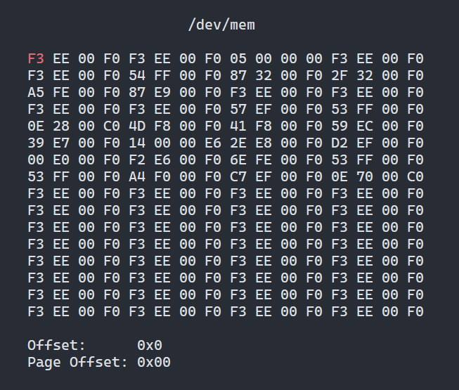

# Read Write on Linux

## Build

1. Install Rust toolchain

   ```sh
   curl --proto '=https' --tlsv1.2 -sSf https://sh.rustup.rs | sh
   ```

2. Build and install the executables

   ```sh
   # Build release verion of devmem
   cargo build --release

   # Copy devmem to /usr/bin/
   sudo cp target/release/rw /usr/bin/
   sudo cp target/release/devmem /usr/bin/
   sudo cp target/release/rwapi /usr/bin/
   ```

## `devmem`



Root privileges are required to run `devmem`.

### Navigation

|Operation|Key(s)|
|-|-|
|Next Cell|`l` or `ArrowLeft`|
|Previous Cell|`h` or `ArrowRight`|
|Next Line|`j` or `ArrowDown`|
|Previous Line|`k` or `ArrowUp`|
|Next Page|`n` or `PageDown`|
|Previous Page|`p` or `PageUp`|

In addition to above ways, you can also jump to specified address. Press `J`, enter the address, then press `Enter` key. You can quit the Input

### Data Type of Cell

|Data Type|Key|
|-|-|
|Byte(default)|`B`|
|Word|`W`|
|Double Word|`D`|
|Quad Word|`Q`|

### Date Write

1. Navigate to an address.
2. Press `e`.
3. Input the data you want to write to the address.
   - Specify data type by following prefixes:
      |Prefix|Data Type|
      |-|-|
      |**B:**|Byte|
      |**W:**|Word|
      |**DW:**|Double Word|
      |**QW:**|Quad Word|
      |**DQW:**|Double Quad Word|
   - Data will be written to memory byte by byte if no prefix specified.
4. Press `Enter`.
